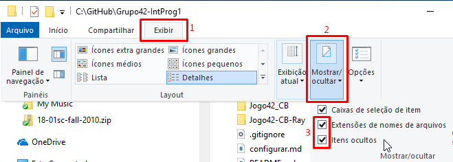

# Instruções para configurar o ambiente de desenvolvimento
Instruções para instalar/configurar no Windows as ferramentas e bibliotecas necessárias:

* [Configurar Windows Explorer](#configurar-windows-explorer)
* [Instalar o Code::Blocks](#instalar-o-codeblocks)
* [Instalar o Raylib](#instalar-o-raylib)
  * [Configurar o Code::Blocks para Raylib](#configurar-o-codeblocks-para-raylib)
* [Instalar o SDL](#instalar-o-sdl)
* [Instalar o GitHub Desktop](#instalar-o-github-desktop)

<small><i><a href='http://ecotrust-canada.github.io/markdown-toc/'>Table of contents generated with markdown-toc</a></i></small>

## Configurar Windows Explorer
Por padrão, o Explorer não mostra extensões de arquivos com extensão conhecida, nem mostra arquivos ocultos.

Em qualquer janela do explorer, acesse:
1. Aba `exibir`
2. `Mostrar/ocultar`
3. Marque `Extensões de nomes de arquivos` e `Itens ocultos`

## Instalar o Code::Blocks
http://www.codeblocks.org/downloads/26  
Baixe e execute o instalador `codeblocks-17.12mingw-setup.exe`.

## Instalar o Raylib
https://raysan5.itch.io/raylib  
Baixe e execute o instalador `raylib 2.5 Windows Installer (with MinGW compiler)`.

### Configurar o Code::Blocks para Raylib

## Instalar o SDL
https://www.libsdl.org/download-2.0.php  
Baixe o arquivo `SDL2-devel-2.0.9-mingw.tar.gz`.

Dentro desse arquivo compacatado há a pasta `SDL2-2.0.9` (Pode ser necessário descompactá-lo duas vezes). Coloque essa pasta `SDL2-2.0.9` em `C:\Users\Public\` (ficará `C:\Users\Public\SDL2-2.0.9\`).

**Obs:** Esse procedimento funciona também em computadores públicos (como os dos laboratórios da UFRPE).

## Instalar o GitHub Desktop
https://desktop.github.com/  
O instalador não precisa de privilégio administrativo.